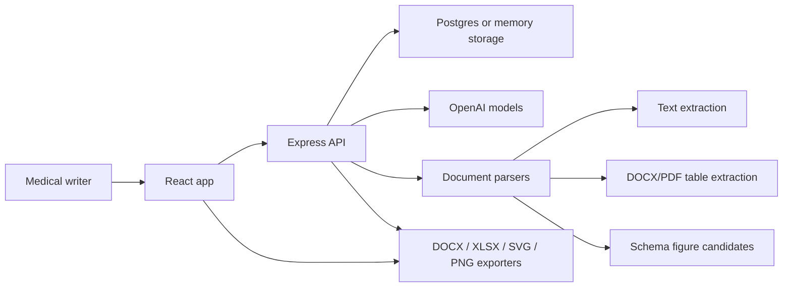
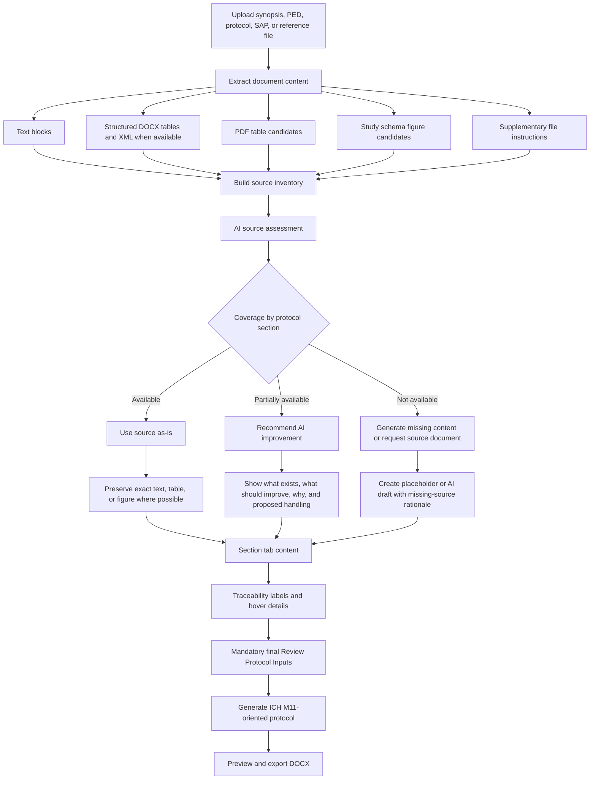
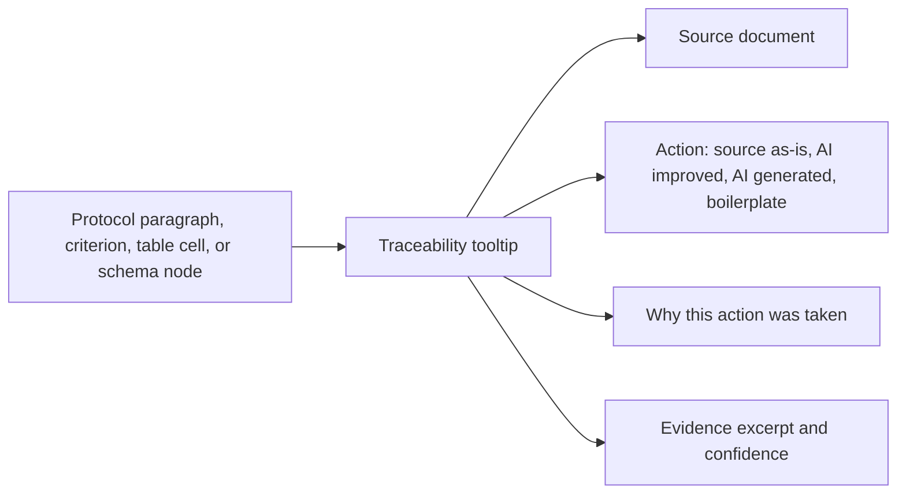

# Evidence Copilot: Clinical Protocol Development App

Evidence Copilot is a clinical study protocol development application. It helps a medical writer turn a synopsis, protocol excerpt, PED, SAP, or reference protocol into a controlled protocol draft. The app is built around source review, section-by-section decisions, traceability, and final protocol export rather than blind document generation.

The core workflow is:

1. Upload or paste source material.
2. Analyze what protocol content is already available, partially available, or missing.
3. Decide section by section whether to use source content as-is, improve it with AI, or generate missing content.
4. Preserve exact source tables and figures where possible.
5. Generate an ICH M11-oriented protocol draft with traceability and exportable Word output.

## Tech Stack

- Frontend: React, TypeScript, Vite, Tailwind CSS, Radix UI.
- Main backend: Express, TypeScript, Drizzle ORM.
- Storage: PostgreSQL/Neon in production, in-memory storage for local testing.
- AI: OpenAI API for source assessment, section review, protocol generation, and structured extraction.
- Document handling: DOCX, PDF, TXT parsing; DOCX export; XLSX export for schedules.
- Optional extraction service: FastAPI service under `backend/` for richer document extraction workflows.
- Deployment target: Railway.

## High-Level Architecture



## End-to-End Workflow



## Source Coverage Logic

The app classifies each major protocol area before content is generated.

| Coverage state | Meaning | Default action | User-facing result |
| --- | --- | --- | --- |
| Available | The source has protocol-ready content for the section. | Use source as-is. | The app copies or reproduces the source content and keeps traceability. |
| Partially available | The source has useful facts but wording, details, or regulatory completeness are weak. | Improve with AI. | The app shows what was found, what should be improved, why it matters, and lets the user apply the recommendation. |
| Not available | The source does not contain enough information for the section. | Generate with AI or request a reference document. | The app labels generated content and explains what source is missing. |

The goal is to avoid unnecessary AI rewriting. If source content is strong, the app should preserve it. If content is weak or missing, AI is used with explicit rationale.

## Main Tabs

### Synopsis

The Synopsis tab is the intake and source-assessment area.

It supports:

- Pasting synopsis text.
- Uploading source documents.
- Running source readiness analysis.
- Identifying available, partial, and missing content.
- Exporting a source assessment report for discussion with the clinical team.

The source assessment report is intended to answer:

- What can be used directly?
- What should be improved before protocol generation?
- What is missing from the source?
- Which additional documents may be needed, such as IB, SmPC, SAP, pharmacy manual, or prior protocol?
- What design, objective, population, endpoint, and safety assumptions should be reviewed?

### Schedule of Activities

The Schedule of Activities tab handles visit schedules and assessment matrices.

The app can:

- Generate a schedule from source text.
- Use a source schedule as-is when it is present.
- Preserve a DOCX source SoA table more directly when possible.
- Split wide schedules into readable tables.
- Export schedules to Excel.
- Carry source traceability for rows, visits, and cells.

Best result by source type:

- DOCX source with native table: best for exact table preservation because the original Word table structure can be reused.
- PDF with selectable table text: usable, but table reconstruction can lose merged headers or layout details.
- Scanned PDF or image table: requires OCR or vision-style extraction and should be reviewed carefully.

### Inclusion/Exclusion Criteria

The Inclusion/Exclusion tab manages eligibility criteria.

The app can:

- Extract criteria from source documents.
- Separate inclusion and exclusion criteria.
- Preserve source wording when criteria are complete.
- Improve partial criteria when specificity is missing.
- Generate missing criteria only when the source is insufficient.
- Keep item-level traceability.

The preferred user experience is that complete criteria are reproduced directly and only unclear or missing areas are surfaced for review.

### Study Schema

The Study Schema tab creates a visual study flow.

The app supports two schema paths:

1. Source figure reproduction.
2. Generated editable schema.

When a study schema figure is detected in an uploaded document, the system should:

- Store a `sourceFigure` artifact.
- Show the original source preview if available.
- Extract periods, arms, randomization, milestones, follow-up, and key labels.
- Create an editable redraw that is close to the source figure.
- Preserve the source evidence and confidence.

For example, if a source figure shows screening, randomization, three treatment arms, a double-blind period, an open-label period, endpoint analysis, and follow-up, the redraw should represent those same study design elements rather than using a generic flow chart.

Schema outputs can be exported as:

- PNG.
- SVG.
- JSON.

### Safety and Drug Handling

This tab focuses on drug-specific safety and operational content.

The app should detect one or more study drugs and assess whether the source contains:

- Dose and administration instructions.
- Storage and accountability details.
- Dose interruption, reduction, or discontinuation rules.
- AE, SAE, AESI, pregnancy, and product complaint reporting.
- Contraception and pregnancy testing requirements.
- Pharmacy and unblinding procedures.

If the source lacks drug-specific safety information, the app should recommend uploading supporting documents such as an Investigator's Brochure, SmPC, prescribing information, pharmacy manual, or product complaint guidance.

### Statistical Analysis Plan

The Statistical Analysis Plan tab captures statistical protocol content, including:

- Endpoints.
- Estimands.
- Analysis populations.
- Sample size assumptions.
- Interim analysis.
- Missing data handling.
- Multiplicity and sensitivity analyses.

If statistical details are partial, the app should explain exactly what is missing rather than giving only a generic recommendation.

### Generate

The Generate tab is the final control point before protocol generation.

It provides:

- Section selection.
- Boilerplate insertion.
- Mandatory Review Protocol Inputs.
- Final generation.
- Protocol preview.
- DOCX export.

The final review should include both:

- Outputs produced in the section tabs.
- Other M11 protocol sections that may not have their own tab.

### Protocol Document

This tab displays the generated protocol and traceability information. It is used for reviewing generated sections before export.

## Traceability Model

Traceability is attached to generated or copied content where possible.

A traceability item can include:

- Source document name.
- Source section, page, or table.
- Whether the content was copied, improved, generated, or boilerplate.
- Why AI changed or generated the content.
- Confidence.
- Evidence excerpt.

Example:



## Exact Source Preservation

For DOCX files, the best way to preserve complex source content is to reuse the original Word XML when the user selects a source-as-is option.

This is especially important for:

- Schedule of Activities tables.
- Complex merged-cell tables.
- Tables with landscape orientation.
- Tables with nested column headers.
- Sponsor template boilerplate.

If a source SoA table is preserved from DOCX, the generated protocol should also preserve the page orientation required for that table where possible. Wide SoA pages may need landscape orientation while normal narrative sections remain portrait.

PDF tables are harder because a PDF is a visual layout, not a semantic table. The app can reconstruct a table from text or OCR, but exact layout preservation is less reliable than DOCX table preservation.

## Protocol Generation and M11 Structure

The protocol generator is aligned to an ICH M11-style structure. The generated document includes major protocol sections such as:

- Title Page and Protocol Identifiers.
- Protocol Summary.
- Trial Schema.
- Schedule of Activities.
- Introduction.
- Trial Objectives and Associated Estimands.
- Trial Design.
- Trial Population.
- Trial Intervention and Concomitant Therapy.
- Trial Intervention and Participant Discontinuation.
- Trial Assessments and Procedures.
- Safety Reporting and Product Complaints.
- Statistical Considerations.
- Trial Oversight and Other General Considerations.
- Administrative and Reference Appendices.

The app should use the section tabs as controlled inputs and then complete the remaining required protocol sections during final generation.

## Boilerplate Handling

Boilerplate text is used for standard protocol language, not for study-specific facts. Boilerplate should remain identifiable in the output so the user can distinguish:

- Source-derived content.
- AI-improved content.
- AI-generated content.
- Boilerplate text.

The Word template may use grey text or other styling for boilerplate. The export pipeline should preserve that styling where possible when boilerplate is inserted from the template.

## Local Development

From the app directory:

```bash
cd /Users/mikhailnikonorov/app_download_run
npm install
cp .env.example .env
```

Set your OpenAI API key in `.env`:

```bash
OPENAI_API_KEY=sk-your-key-here
USE_MEM_STORAGE=true
```

Start the main app:

```bash
PORT=5001 USE_MEM_STORAGE=true npm run dev
```

Open:

```text
http://127.0.0.1:5001
```

Optional FastAPI extraction service:

```bash
npm run dev:api
```

## Environment Variables

| Variable | Required | Purpose |
| --- | --- | --- |
| `OPENAI_API_KEY` | Yes for AI features | Enables source assessment, section review, and generation. |
| `DATABASE_URL` | Required for persistent production storage | PostgreSQL/Neon connection string. |
| `USE_MEM_STORAGE` | Local only | Enables in-memory development storage. Data will not persist across restarts. |
| `PORT` | Optional | Port for the Express server. |

Important: use `DATABASE_URL` in production. In-memory storage is only for local testing and will not preserve projects reliably.

## Build and Production Run

```bash
npm run build
npm run start
```

For Railway deployment, configure:

- `OPENAI_API_KEY`
- `DATABASE_URL`
- Any required file extraction or storage variables.

Then use the project build and start commands:

```bash
npm run build
npm run start
```

## Recommended Test Checklist

Use this checklist after major changes:

1. Create a new protocol project.
2. Upload a DOCX synopsis with a Schedule of Activities table.
3. Confirm the source assessment classifies sections as available, partial, or missing.
4. Confirm strong source content is reproduced without unnecessary AI rewriting.
5. Confirm partial content shows specific improvement rationale.
6. Confirm missing content identifies the needed source document or creates a labeled placeholder.
7. In Schedule of Activities, test source-as-is table preservation.
8. In Study Schema, test source figure detection, preview, editable redraw, and PNG/SVG export.
9. In Safety and Drug Handling, confirm all study drugs are detected.
10. Run Review Protocol Inputs in the Generate tab.
11. Generate the full protocol.
12. Refresh the browser and reopen the project to confirm persistence.
13. Export DOCX and inspect heading levels, numbering, page orientation, boilerplate styling, SoA formatting, and traceability behavior.

## Known Limitations

- Exact table reproduction is strongest for DOCX source tables. PDF tables may require OCR or vision-assisted extraction.
- Source figure reproduction is an editable redraw, not a pixel-perfect clone.
- AI-generated content must be reviewed by a qualified medical writer, clinician, statistician, or regulatory expert.
- If production storage is not configured, generated projects and review decisions may not persist.
- Very large generated documents should be saved to backend storage rather than browser local storage to avoid quota errors.

## Development Notes

Core areas of the codebase:

- `client/src/`: React UI and section tabs.
- `server/`: Express API, generation routes, upload handling, storage, and exporters.
- `shared/`: shared schema definitions.
- `backend/`: optional FastAPI extraction service.
- `server/templates/`: protocol template and document export support.

When changing generation behavior, update both:

- The section-specific review/generation logic.
- The final protocol generation logic in the Generate tab flow.

This keeps the tab-level output and the final protocol export consistent.
